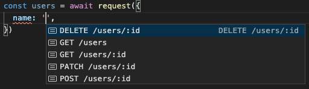
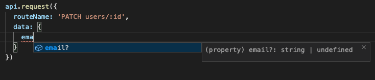
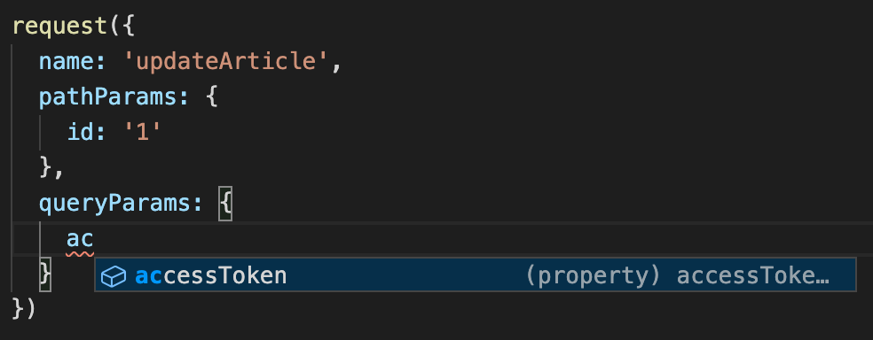
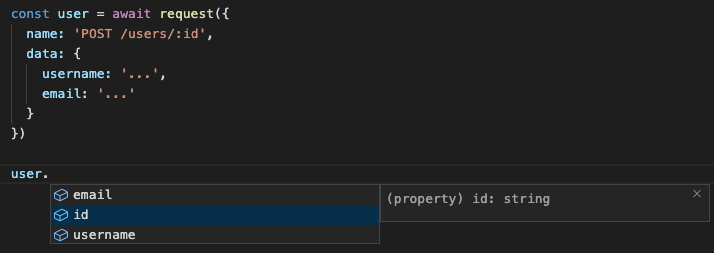
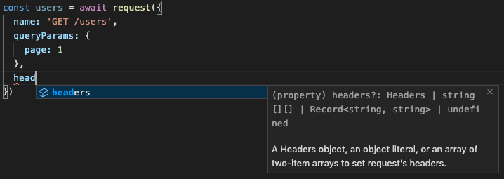

<div align="center">
  <h1>
    TypeScript Object Schema
    <br/>
    <br/>
  </h1>
    <br/>
    <a href="https://www.npmjs.com/package/ts-object-schema">
      
    </a>
    <br/>
    <br/>
    <br/>
    Use the powerful of TypeScript Intellisense<br/>
    <br/>
  <br/>
  <br/>
  <pre>npm i <a href="https://www.npmjs.com/package/ts-object-schema">ts-object-schema</a></pre>
  <br/>
  <br/>
</div>

* [Motivation](#motivation)
* [Tutorial](#tutorial)
* [Code examples](#examples)
  * [fetch](#fetch)
  * [axios](#examples)
* [IntelliSense examples](#intellisense-examples)
* [Things to know](#things-to-know)

## Motivation

TypeScript is a powerful assistant when your are developping, with autocomplete suggestion and complilation errors. I made some utils to define a schema object and then avoid to always import types or interfaces if your shema doesn't change.

## Tutorial

My use case come from HTTP request pattern. Our REST API schema is always the same and can be define in one place in the application. Let's see our requirement for make HTTP request:

- the request need an `url` to work correctly.
- the request have a specific `method`, like GET, POST, PATCH...
- the url can contain `path params`, like a resource id.
- the url can contain `query params`, like a pagination
- the request can contain `data` (or `body`)
- the request contain a `response`, with always the same data types

Some of these data are dynamics, and others never change. `url` and `method` never change, while `path params`, `query params`, `data` and `response` depends on the context.

Let's define our schema:

```ts
const schema = {
  'PATCH users/:id': {
    url: (pathParams: { id: string }) => `users/${pathParams.id}`,
    method: 'PATCH',
    queryParams: null,
    data: {} as {
      username?: string,
      email?: string
    },
    response: {} as {
      id: string,
      username: string,
      email: string
    }
  },
}
```

*Wait, what is that object ? Is a plain JavaScript object or a TypeScript definition ?*

It's both !

Technicaly, it's a plain JavaScript object, but it's also used as TypeScript definition for some keys with the powerful of `as` TypeScript keyword.

Now, let's build a `request()` function, base on native `fetch` browser:

```js
import queryString from 'query-string'

const request = (config) => {
  const {
    url,
    method,
    data,
    queryParams,
    ...restConfig
  } = config

  const baseURL = 'https://api.com'
  const queryParamsStr = queryString.stringify(queryParams)
  const fullURL = `${baseURL}/${url}?${queryParamsStr}`

  return fetch(fullURL, {
    method,
    body: JSON.stringify(data),
    ...restConfig
  }).then(res => res.json())
}
```

It's a very basic function with some data handling, like stringify `query params` and `data`, concat `baseURL` and return a promise with plain JavaScript object.

Currently, TypeScript doesn't know anything about the request schema. It could be usefull if TS can autocomplete config data depends on the request ?

`ts-object-schema` provide 3 utils types to build a powerfull config schema:

```js
import { ObjectParams, FnParams, Extends } from 'ts-object-schema'
```

* `ObjectParams` - used to add an object of your schema in your config
* `FnParams` - used to add a function argument of your schema in your config
* `Extends` - used to extends an object (internally, it avoid conflict with `ObjectParams` and `FnParams` keys)

Too complicated ? Let's see an example:

```ts
type Schema = typeof schema
type SchemaKeys = keyof Schema

type RequestConfig = NonNullable<Parameters<typeof fetch>[1]>

type Config<T extends SchemaKeys> =
  { name: T }
  & FnParams<Schema[T], 'url', 'pathParams'>
  & ObjectParams<Schema[T], 'queryParams'>
  & ObjectParams<Schema[T], 'data'>
  & Extends<Schema[T], RequestConfig>
```

What `Config` look like ? It's equivalent to:

```js
interface Config<T extends SchemaKeys> {
  name: T,
  pathParams: {
    ...
  }
  queryParams: {
    ...
  }
  data: {
    ...
  }
  // and other RequestConfig properties, like headers, cors, etc...
}
```

`pathParams`, `queryParams` and `data` will depends on `name`. In our plain JS object schema, `name` is the key of object: `PATCH users/:id`, but you can name it like you want.

*Why use a merge of Typescript Type instead of an interface extends ?*

Because `ObjectParams` will make your key optional depends on your schema definition, and we can't merge dynamic object with `interface extends` .

Now, let's build our `Request` function type:

```ts
type Request = <T extends SchemaKeys>(config: Config<T>) => Promise<Schema[T]['response']>
```

We can now use `Request` as a type of our `request()` function.

*But wait, why our `Config` doesn't include `url` and `method` ?*

Because they never change for a specific end point. In our schema, they only are JS plain value. Let's update our `request()`:

```diff
import queryString from 'query-string'

const request = (config) => {
  const {
-   url,
-   method,
+   name,
+   pathParams,
    data,
    queryParams,
    ...restConfig,
  } = config

+ const { url, method } = schema[name]

+ const urlWithPathParams = typeof url === 'function'
+   ? url(pathParams)
+   : url

  const baseURL = 'https://api.com'
  const queryParamsStr = queryString.stringify(queryParams)
- const fullURL = `${baseURL}/${url}?${queryParamsStr}`
+ const fullURL = `${baseURL}/${urlWithPathParams}?${queryParamsStr}`

  return fetch(fullURL, {
    method,
    body: JSON.stringify(data),
    ...restConfig,
  }).then(res => res.json())
}
```

We have finished ! You can now use `request()` and TypeScript will automcomplete and show errors if you provide the wrong config.

## Examples

### fetch()

```ts
import queryString from 'query-string'
import { ObjectParams, FnParams, Extends } from 'ts-object-schema'

const schema = {
  'GET /users': {
    url: 'users',
    method: 'GET',
    queryParams: {} as null | {
      page?: number,
      pageSize?: number,
    },
    data: null,
    response: {} as {
      id: string,
      username: string,
      email: string
    }[]
  },
  'GET /users/:id': {
    url: (pathParams: { id: string }) => `users/${pathParams.id}`,
    method: 'GET',
    queryParams: null,
    data: null,
    response: {} as {
      id: string,
      username: string,
      email: string
    }
  },
  'POST /users/:id': {
    url: 'users',
    method: 'POST',
    queryParams: null,
    data: {} as {
      username: string,
      email: string
    },
    response: {} as {
      id: string,
      username: string,
      email: string
    }
  },
  'PATCH /users/:id': {
    url: (pathParams: { id: string }) => `users/${pathParams.id}`,
    method: 'PATCH',
    queryParams: null,
    data: {} as {
      username?: string,
      email?: string
    },
    response: {} as {
      id: string,
      username: string,
      email: string
    }
  },
  'DELETE /users/:id': {
    url: (pathParams: { id: string }) => `users/${pathParams.id}`,
    method: 'DELETE',
    queryParams: null,
    data: null,
    response: null
  },
}

type Schema = typeof schema
type SchemaKeys = keyof Schema

type RequestConfig = NonNullable<Parameters<typeof fetch>[1]>

type Config<T extends SchemaKeys> =
  { name: T }
  & FnParams<Schema[T], 'url', 'pathParams'>
  & ObjectParams<Schema[T], 'queryParams'>
  & ObjectParams<Schema[T], 'data'>
  & Extends<Schema[T], RequestConfig>

type Request = <T extends SchemaKeys>(config: Config<T>) => Promise<Schema[T]['response']>

const request: Request = (config) => {
  const {
    name,
    pathParams,
    data,
    queryParams,
    ...restConfig
  } = config

  const { url, method } = schema[name]

  const urlWithPathParams = typeof url === 'function'
    ? url(pathParams)
    : url

  const baseURL = 'https://api.com'
  const queryParamsStr = queryString.stringify(queryParams)
  const fullURL = `${baseURL}/${urlWithPathParams}?${queryParamsStr}`

  return fetch(fullURL, {
    method,
    body: JSON.stringify(data),
    ...restConfig
  }).then(res => res.json())
}
```

Usages:

```ts
// GET All
const users = await request({
  name: 'GET /users',
  queryParams: {
    page: 1,
    pageSize: 10,
  }
})

// GET ONE
const user = await request({
  name: 'GET /users/:id',
  pathParams: {
    id: '1'
  }
})

// POST
const user = await request({
  name: 'POST /users',
  data: {
    username: '...'
  }
})
```

### Axios

*Note*: schema is the same than `fetch` example above, except the `queryParams` was renamed `params` because query parametters on axios config are named `params`. But you can use what you want

```ts
import axios, { AxiosRequestConfig, AxiosPromise } from 'axios'
import { ObjectParams, FnParams, Extends } from 'ts-object-schema'

const schema = {
  'GET /users': {
    url: 'users',
    method: 'GET',
    params: {} as null | {
      page?: number,
      pageSize?: number,
    },
    data: null,
    response: {} as {
      id: string,
      username: string,
      email: string
    }[]
  },
  'GET /users/:id': {
    url: (pathParams: { id: string }) => `users/${pathParams.id}`,
    method: 'GET',
    params: null,
    data: null,
    response: {} as {
      id: string,
      username: string,
      email: string
    }
  },
  'POST /users/:id': {
    url: 'users',
    method: 'POST',
    params: null,
    data: {} as {
      username: string,
      email: string
    },
    response: {} as {
      id: string,
      username: string,
      email: string
    }
  },
  'PATCH /users/:id': {
    url: (pathParams: { id: string }) => `users/${pathParams.id}`,
    method: 'PATCH',
    params: null,
    data: {} as {
      username?: string,
      email?: string
    },
    response: {} as {
      id: string,
      username: string,
      email: string
    }
  },
  'DELETE /users/:id': {
    url: (pathParams: { id: string }) => `users/${pathParams.id}`,
    method: 'DELETE',
    params: null,
    data: null,
    response: null
  },
}

type Schema = typeof schema
type SchemaKeys = keyof Schema

type Config<T extends SchemaKeys> =
  { name: T }
  & FnParams<Schema[T], 'url', 'pathParams'>
  & ObjectParams<Schema[T], 'params'>
  & ObjectParams<Schema[T], 'data'>
  & Extends<Schema[T], AxiosRequestConfig>

type Request = <T extends SchemaKeys>(config: Config<T>) => AxiosPromise<Schema[T]['response']>

const axiosInstance = axios.create({ baseURL: 'https://api.com' })
const request: Request = axiosInstance.request
```

Usages:
```ts
request({
  name: 'GET /users',
  params: {
    page: 1
  }
}).then(res => {
  res.data.map(user => {
    console.log(user.username)
  })
})
```

## IntelliSense examples

* `name`  


* `data`  


* `queryParams`  


* `response`  


* `othersProperties`  


## Things to know

### Schema keys names

Each keys of the `schema` object can be named like you want. In examples, names are `GET users`, `GET users/:id`, but you can named it `GET_users`, `users get`, `retrieve users`, `update users/id`, etc. Keys are use by TypeScript to find the correct route schema, so it's completely arbitrary. TypeScript will autocomplete keys for you, so even with a complicated format like `GET users/:id`, you don't have to remember it.