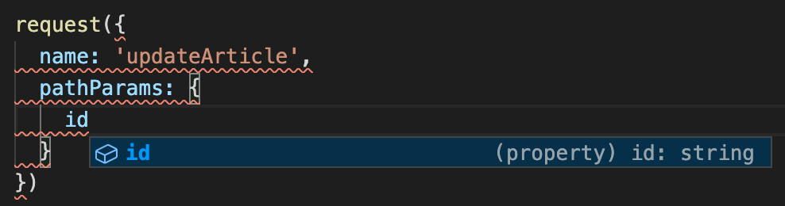
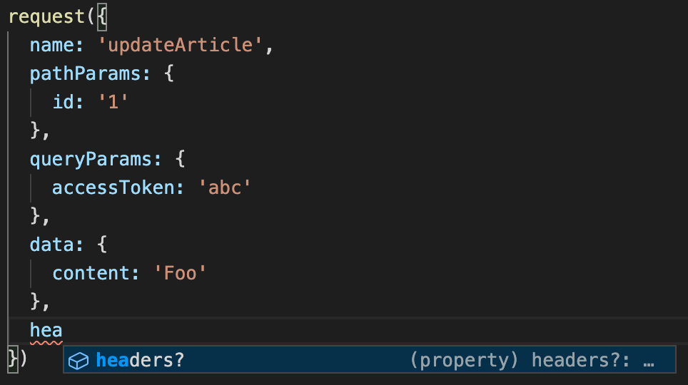

<div align="center">
  <h1>
    TypeScript Request Schema
    <br/>
    <br/>
  </h1>
  <br/>
  <a href="https://www.npmjs.com/package/typescript-request-schema">
    
  </a>
  <br/>
  <br/>
  <br/>
  It's time to type your HTTP requests<br/>
  <br/>
  <br/>
  <pre>npm i <a href="https://www.npmjs.com/package/typescript-request-schema">typescript-request-schema</a></pre>
  <br/>
  <br/>
</div>

* [Motivation](#motivation)
* [Quick example](#quick-example)
* [Full example with window.fetch](#full-example-with-windowfetch)
* [API](#API)
* [IntelliSense examples](#intellisense-examples)
* [Advanced config](#advanced-config)

## Motivation

API request have always the same data type: `url`, `method`, `query params`, `body`, and `response`. This package aim to easily define their types.

# Quick example

```js
import { Config, Response } from 'typescript-request-schema'

const schema = {
  updateArticle: {
    url: (pathParams: { id: string; }) => `/articles/${pathParams.id}`,
    method: 'PATCH',
    queryParams: {} as {
      accessToken: string;
    },
    data: {} as {
      title?: string;
      content?: string;
    },
    response: {} as {
      id: string;
      title: string;
      content: string;
      updatedAt: string;
    }
  }
}

type Schema = typeof schema
type RequestName = keyof Schema
type ExtraConfig = { ... }
type RequestConfig<T extends RequestName> = Config<T, Schema, ExtraConfig>
type RequestResponse<T extends RequestName> = Promise<Response<T, Schema>>

function request<T extends RequestName>(config: RequestConfig<T>): RequestResponse<T> {
  const { name, data, queryParams, pathParams, ...restConfig } = config
  const { url, method } = schema[name]

  ...
}

const article = await request({
  name: 'updateArticle',
  pathParams: {
    id: '...'
  },
  queryParams: {
    accessToken: '...'
  },
  data: {
    title: '...'
  }
})
```

It's up to you to create your own request implementation.

`queryParams`, `data` and `response` are only use as TypeScript type thanks to `as` keyword.

## Full example with window.fetch

```js
import { Config, Response, validateSchema } from 'typescript-request-schema'
import { schema } from './schema'

export const schema = {
  updateArticle: {
    url: (pathParams: { id: string; }) => `/articles/${pathParams.id}`,
    method: 'PATCH',
    queryParams: {} as {
      accessToken: string;
    },
    data: {} as {
      title?: string;
      content?: string;
    },
    response: {} as {
      id: string;
      title: string;
      content: string;
      updatedAt: string;
    }
  }
}

validateSchema(schema) // only use as TS checker

type Schema = typeof schema
type RequestName = keyof Schema
type ExtraConfig = NonNullable<Parameters<typeof fetch>[1]>
type RequestConfig<T extends RequestName> = Config<T, Schema, ExtraConfig>
type RequestResponse<T extends RequestName> = Promise<Response<T, Schema>>

function request<T extends RequestName>(config: RequestConfig<T>): RequestResponse<T> {
  const { name, data, queryParams, pathParams, ...restConfig } = config
  const { url, method } = schema[name]

  const urlWithPathParams = (typeof url === 'function' && pathParams)
    ? url(pathParams)
    : url

  const queryParamsAsString = Object.entries(queryParams || {})
    .map(([key, value]) => `${key}=${value}`)
    .join('&')

  const baseUrl = 'http://api.website.com'
  const fullUrl = `${baseUrl}${urlWithPathParams}?${queryParamsAsString}`

  return fetch(fullUrl, {
    method,
    body: data ? JSON.stringify(data) : undefined,
    ...restConfig
  }).then(res => res.json())
}

const article = await request({
  name: 'updateArticle',
  pathParams: {
    id: '...'
  },
  queryParams: {
    accessToken: '...'
  },
  data: {
    title: 'new title'
  }
})
```

## with axios ?

It's up to you to define your own `request` implementation, so you can use any request library.

```js
import axios, { AxiosRequestConfig, AxiosPromise } from 'axios'

...

type Schema = typeof schema
type RequestName = keyof Schema
type ExtraConfig = AxiosRequestConfig
type RequestConfig<T extends RequestName> = Config<T, Schema, ExtraConfig>
type RequestResponse<T extends RequestName> = AxiosPromise<Response<T, Schema>>

function request<T extends RequestName>(config: RequestConfig<T>): RequestResponse<T> {
  const { name, data, queryParams, pathParams, ...restConfig } = config
  const { url, method } = schema[name]

  const urlWithPathParams = (typeof url === 'function' && pathParams)
    ? url(pathParams)
    : url

  const baseUrl = 'http://api.website.com'

  return axios.request({
    url: `${baseUrl}${urlWithPathParams}`,
    method,
    params: queryParams,
    data,
  })
}
```

## API

* `Config<RequestName, Schema, ExtraConfig>`
* `Response<RequestName, Schema>`
* `validateSchema()` - use for TS check

## IntelliSense examples

* `name`  


* `pathParams`  


* `queryParams`  


* `data`  


* `response`  


* `extraProperties`  


## Advanced config

You can change the key of each properties

```js
interface Conf {
  RouteNameKey: 'name';
  PathParamsKey: 'pathParams';
  QueryParamsKey: 'queryParams';
  URLKey: 'url';
  DataKey: 'data';
  ResponseKey: 'response';
  MethodKey: 'method';
}

const schema = {
  ...
}

validateSchema<Conf>(schema)

...

type RequestConfig<T extends RequestName> = Config<T, Schema, ExtraConfig, Conf>
```